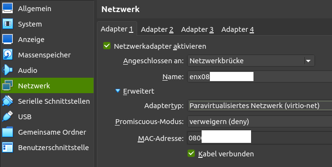
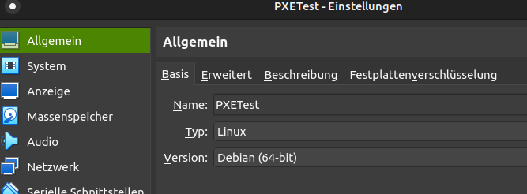
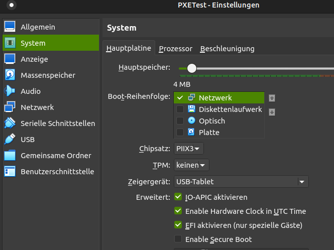
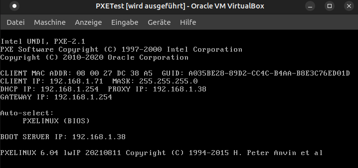
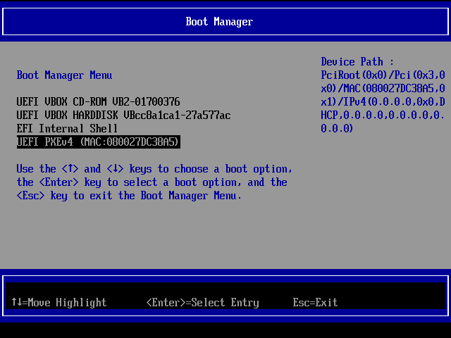
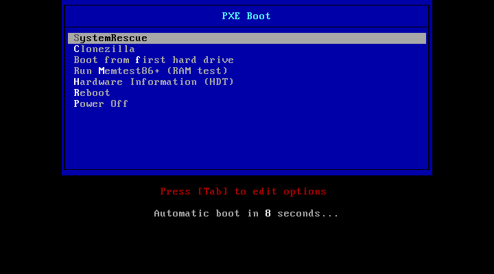
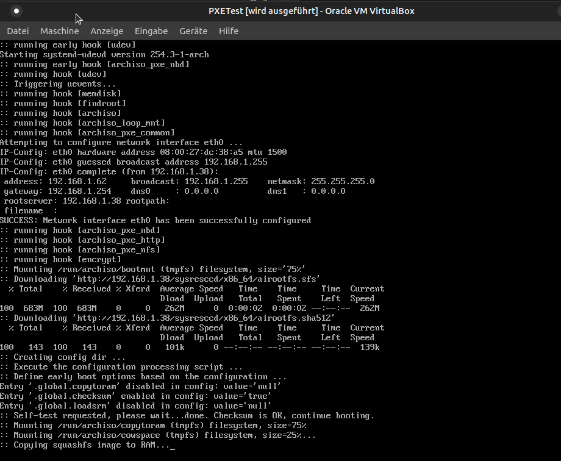
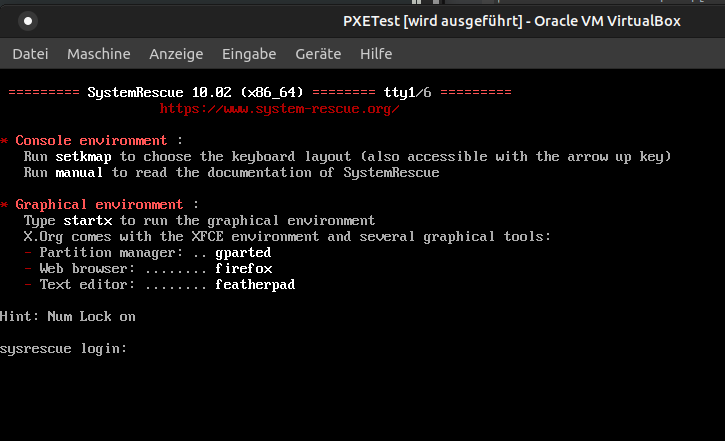

# PXE Boot SystemRescue Live Linux

PXE network boot a SystemRescue live Linux (https://www.system-rescue.org).

Use case:

- rescue-boot existing headless-installations (e.g. Raspi, home-automation server) to adjust partioning, fix system disk issues, etc.
- boot PCs without using CD/DVD/USB media, e.g., for maintenance purposes (disk partioning etc.)

## Requirements

- 2 PCs/VMs (host and client)
- Internet connection to install Linux packages (dnsmasqd, apache2, ...)
- Network connection in the _same_ subnet (or adequate DHCP/BOOTP routing)
- Existing DHCP server (e.g., Fritz!Box router)

## How-To

1. Setup a Linux PC/VM as PXE host
   - Virtualbox: use network bridge and (important!) virtio-driver (other network drivers were too slow for me)
2. run `setup.sh` (as root; check script before)
3. Prepare neccessary SystemRescue files
   1. Download ISO from https://www.system-rescue.org
   2. Copy `sysresccd/` folder from ISO to `/tftpboot/` (see below for expected folder structure)
4. (Optional) prepare Clonezilla
   1. Download ISO from https://clonezilla.org
   2. Copy `live/` folder from ISO to `/tftpboot/` (see below for expected folder structure)
5. Adjust IP addresses 
   - `/etc/dnsmasq.conf` - match your subnet (e.g., `192.168.1.0`)
   - `/tftpboot/boot/pxelinux.cfg/default` - match your IP for values of `http://<YOUR IP>/...`
6. On host: `tail -f /var/log/dnsmasq.log` (or `lnav /var/log/dnsmasq.log`)
7. Boot client and adjust BIOS/UEFI settings to do network boot.
8. Reboot client --> PXE should boot.
   - `/var/log/dnsmasq.log` should tell about DHCP-boot and PXE requests.
   - See below for working example.
9. For SystemRescue: `ssh root@IP` (password: see `./tftpboot/pxelinux.cfg/default`)

Expected folder structure:

```
/tftpboot/
├── boot
│   ├── bios
│   │   ├── chain.c32 -> /usr/lib/syslinux/modules/bios/chain.c32
│   │   ├── clonezilla -> /tftpboot/clonezilla
│   │   ├── de.ktl -> /tftpboot/boot/de.ktl
│   │   ├── hdt -> /tftpboot/hdt
│   │   ├── hdt.c32 -> /usr/lib/syslinux/modules/bios/hdt.c32
│   │   ├── kbdmap.c32 -> /usr/lib/syslinux/modules/bios/kbdmap.c32
│   │   ├── ldlinux.c32 -> /usr/lib/syslinux/modules/bios/ldlinux.c32
│   │   ├── libcom32.c32 -> /usr/lib/syslinux/modules/bios/libcom32.c32
│   │   ├── libgpl.c32 -> /usr/lib/syslinux/modules/bios/libgpl.c32
│   │   ├── libmenu.c32 -> /usr/lib/syslinux/modules/bios/libmenu.c32
│   │   ├── libutil.c32 -> /usr/lib/syslinux/modules/bios/libutil.c32
│   │   ├── lpxelinux.0 -> /usr/lib/PXELINUX/lpxelinux.0
│   │   ├── menu.c32 -> /usr/lib/syslinux/modules/bios/menu.c32
│   │   ├── poweroff.c32 -> /usr/lib/syslinux/modules/bios/poweroff.c32
│   │   ├── pxelinux.cfg -> /tftpboot/boot/pxelinux.cfg
│   │   ├── reboot.c32 -> /usr/lib/syslinux/modules/bios/reboot.c32
│   │   ├── sysresccd -> /tftpboot/sysresccd
│   │   └── vesamenu.c32 -> /usr/lib/syslinux/modules/bios/vesamenu.c32
│   ├── de.ktl
│   ├── efi64
│   │   ├── chain.c32 -> /usr/lib/syslinux/modules/efi64/chain.c32
│   │   ├── clonezilla -> /tftpboot/clonezilla
│   │   ├── de.ktl -> /tftpboot/boot/de.ktl
│   │   ├── hdt -> /tftpboot/hdt
│   │   ├── hdt.c32 -> /usr/lib/syslinux/modules/efi64/hdt.c32
│   │   ├── kbdmap.c32 -> /usr/lib/syslinux/modules/efi64/kbdmap.c32
│   │   ├── ldlinux.e64 -> /usr/lib/syslinux/modules/efi64/ldlinux.e64
│   │   ├── libcom32.c32 -> /usr/lib/syslinux/modules/efi64/libcom32.c32
│   │   ├── libgpl.c32 -> /usr/lib/syslinux/modules/efi64/libgpl.c32
│   │   ├── libmenu.c32 -> /usr/lib/syslinux/modules/efi64/libmenu.c32
│   │   ├── libutil.c32 -> /usr/lib/syslinux/modules/efi64/libutil.c32
│   │   ├── menu.c32 -> /usr/lib/syslinux/modules/efi64/menu.c32
│   │   ├── poweroff.c32 -> /usr/lib/syslinux/modules/efi64/poweroff.c32
│   │   ├── pxelinux.cfg -> /tftpboot/boot/pxelinux.cfg
│   │   ├── reboot.c32 -> /usr/lib/syslinux/modules/efi64/reboot.c32
│   │   ├── syslinux.efi -> /usr/lib/SYSLINUX.EFI/efi64/syslinux.efi
│   │   ├── sysresccd -> /tftpboot/sysresccd
│   │   └── vesamenu.c32 -> /usr/lib/syslinux/modules/efi64/vesamenu.c32
│   └── pxelinux.cfg
│       └── default
├── clonezilla
│   └── live
│       ├── Clonezilla-Live-Version
│       ├── filesystem.packages
│       ├── filesystem.packages-remove
│       ├── filesystem.squashfs
│       ├── freedos.img
│       ├── initrd.img
│       ├── ipxe.efi
│       ├── ipxe.lkn
│       ├── mt86+x32.efi
│       ├── mt86+x32.mbr
│       ├── mt86+x64.efi
│       ├── mt86+x64.mbr
│       └── vmlinuz
├── hdt
│   ├── modalias.gz
│   └── pci.ids.gz
└── sysresccd
    ├── boot
    │   ├── amd_ucode.img
    │   ├── amd_ucode.LICENSE
    │   ├── intel_ucode.img
    │   ├── intel_ucode.LICENSE
    │   ├── memtest
    │   ├── memtest.COPYING
    │   ├── syslinux
    │   └── x86_64
    ├── pkglist.x86_64.txt
    ├── VERSION
    └── x86_64
        ├── airootfs.sfs
        └── airootfs.sha512
```

## SystemRescue

SSH access:

- `ssh root@IP` (for IP look at HTTP `access.log` or at your DHCP servers dashboard)
- password: see `./tftpboot/pxelinux.cfg/default`

Use X11:

1. `ssh root@<IP>`
2. `nano /etc/ssh/ssd_config`, `X11Forwarding yes`
3. `systemctl reload sshd`
4. `logout`
5. `ssh -X root@<IP>`
6. e.g., `xrandr`, `gparted`, ...

Recommended apps (cf. https://www.system-rescue.org/System-tools/):

- **GParted** is a graphical partition editor which displays, checks, resizes, copies, moves, creates, formats, deletes, and modifies disk partitions.
- testdisk
- GNU **ddrescue** can copy data from and to block devices just like the standard dd program and it is optimized to deal with disks with bad blocks.
- **sfdisk** is a tool to save and restore partition tables to/from a file.
- The **chntpw** command can be used to reset Windows passwords by accessing the disk where Windows is installed.
- Midnight Commander is a text based file manager that you can run from the terminal using the **mc** command. It is very convenient to manipulate files and folders.
- The **hwinfo** and **inxi** commands can be run from the terminal and will display a detail report about the hardware.

## Clonezilla

SSH access:

- `ssh user@IP` (for IP look at HTTP `access.log` or at your DHCP servers dashboard)
- password: see `./tftpboot/pxelinux.cfg/default`

## PXE Booting

### Host

VBox: make sure to select the virtio network adapter. With type Intel the network speed while sending was very low (< 1 MBit/s).



Look at the host's DHCP logfile `/var/log/dnsmasq.log` (here PXE EFI):

```
dnsmasq[5900]: started, version 2.86 DNS disabled
dnsmasq[5900]: compile time options: IPv6 GNU-getopt DBus no-UBus i18n IDN2 DHCP DHCPv6 no-Lua TFTP conntrack ipset auth cryptohash DNSSEC loop-detect inotify dumpfil
dnsmasq-dhcp[5900]: DHCP, proxy on subnet 192.168.56.0
dnsmasq-dhcp[5900]: DHCP, proxy on subnet 192.168.1.0
dnsmasq-tftp[5900]: TFTP root is /tftpboot
dnsmasq-dhcp[5900]: 235051552 available DHCP subnet: 192.168.1.0/255.255.255.0
dnsmasq-dhcp[5900]: 235051552 vendor class: PXEClient:Arch:00007:UNDI:003000
dnsmasq-dhcp[5900]: 235051552 PXE(enp0s3) 08:00:xx:xx:xx:xx proxy
dnsmasq-dhcp[5900]: 235051552 tags: enp0s3
dnsmasq-dhcp[5900]: 235051552 bootfile name: syslinux.efi
dnsmasq-dhcp[5900]: 235051552 server name: 192.168.1.38
dnsmasq-dhcp[5900]: 235051552 next server: 192.168.1.38
dnsmasq-dhcp[5900]: 235051552 sent size:  1 option: 53 message-type  5
dnsmasq-dhcp[5900]: 235051552 sent size:  4 option: 54 server-identifier  192.168.1.38
dnsmasq-dhcp[5900]: 235051552 sent size:  9 option: 60 vendor-class  50:xx:xx:xx:xx:xx:xx:xx:xx
dnsmasq-dhcp[5900]: 235051552 sent size: 17 option: 97 client-machine-id  00:a0:xx:xx:xx:xx:xx:xx:xx:xx:xx:xx:xx:xx...
dnsmasq-tftp[5900]: error 8 User aborted the transfer received from 192.168.1.62
dnsmasq-tftp[5900]: sent /tftpboot/syslinux.efi to 192.168.1.62
dnsmasq-tftp[5900]: sent /tftpboot/syslinux.efi to 192.168.1.62
dnsmasq-dhcp[5900]: 2950128872 available DHCP subnet: 192.168.1.0/255.255.255.0
dnsmasq-dhcp[5900]: 2950128872 available DHCP subnet: 192.168.1.0/255.255.255.0
dnsmasq-tftp[5900]: sent /tftpboot/ldlinux.e64 to 192.168.1.62
dnsmasq-tftp[5900]: file /tftpboot/pxelinux.cfg/a035be28-xxxx-xxxx-xxxx-xxxx not found
dnsmasq-tftp[5900]: file /tftpboot/pxelinux.cfg/01-08-xx-xx-xx-xx-xx not found
dnsmasq-tftp[5900]: file /tftpboot/pxelinux.cfg/C0xxxxxx not found
dnsmasq-tftp[5900]: file /tftpboot/pxelinux.cfg/C0xxxxx not found
dnsmasq-tftp[5900]: file /tftpboot/pxelinux.cfg/C0xxxx not found
dnsmasq-tftp[5900]: file /tftpboot/pxelinux.cfg/C0xxx not found
dnsmasq-tftp[5900]: file /tftpboot/pxelinux.cfg/C0xx not found
dnsmasq-tftp[5900]: file /tftpboot/pxelinux.cfg/C0x not found
dnsmasq-tftp[5900]: file /tftpboot/pxelinux.cfg/C0 not found
dnsmasq-tftp[5900]: file /tftpboot/pxelinux.cfg/C not found
dnsmasq-tftp[5900]: sent /tftpboot/pxelinux.cfg/default to 192.168.1.62
dnsmasq-tftp[5900]: sent /tftpboot/sysresccd/boot/x86_64/vmlinuz to 192.168.1.62
dnsmasq-tftp[5900]: sent /tftpboot/sysresccd/boot/intel_ucode.img to 192.168.1.62
dnsmasq-tftp[5900]: sent /tftpboot/sysresccd/boot/amd_ucode.img to 192.168.1.62
dnsmasq-tftp[5900]: sent /tftpboot/sysresccd/boot/x86_64/sysresccd.img to 192.168.1.62
dnsmasq-dhcp[5900]: 1409916785 available DHCP subnet: 192.168.1.0/255.255.255.0
dnsmasq-dhcp[5900]: 1409916785 client provides name: sysrescue
dnsmasq-dhcp[5900]: 1409916785 available DHCP subnet: 192.168.1.0/255.255.255.0
dnsmasq-dhcp[5900]: 1409916785 client provides name: sysrescue
```

### Client

VBox: configure as type Linux.



VBox: either check or uncheck EFI - both should work.



VBox: select an Intel network adapter. VBox virtio did not work for PXE.


Live screen when booting:


<video width="600" controls>
  <source src="./doc/sysrescboot.webm" type="video/webm">
</video>












## License

AGPL3, see [LICENSE](LICENSE).
